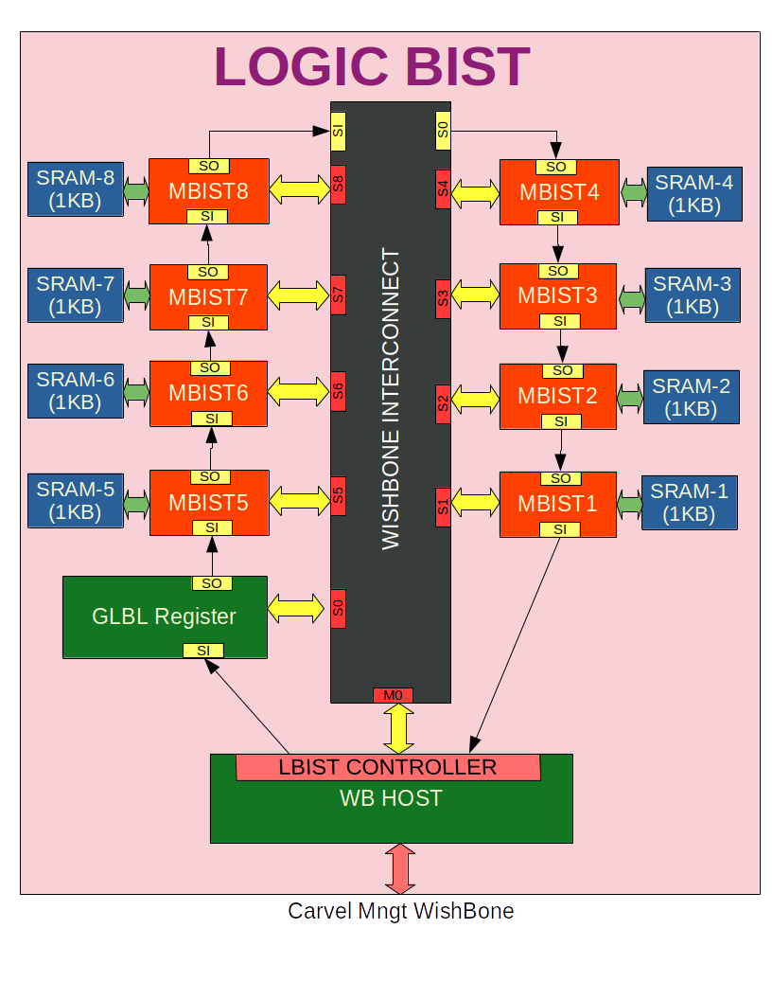

```
  LOGIC BIST Controller


Permission to use, copy, modify, and/or distribute this soc for any
purpose with or without fee is hereby granted, provided that the above
copyright notice and this permission notice appear in all copies.

THE SOC IS PROVIDED "AS IS" AND THE AUTHOR DISCLAIMS ALL WARRANTIES
WITH REGARD TO THIS SOC INCLUDING ALL IMPLIED WARRANTIES OF
MERCHANTABILITY AND FITNESS. IN NO EVENT SHALL THE AUTHOR BE LIABLE FOR
ANY SPECIAL, DIRECT, INDIRECT, OR CONSEQUENTIAL DAMAGES OR ANY DAMAGES
WHATSOEVER RESULTING FROM LOSS OF USE, DATA OR PROFITS, WHETHER IN AN
ACTION OF CONTRACT, NEGLIGENCE OR OTHER TORTIOUS ACTION, ARISING OUT OF
OR IN CONNECTION WITH THE USE OR PERFORMANCE OF THIS SOC.
```

# Table of contents
- [Overview](#overview)
- [Logic Controller Block Diagram](#logic-controller-block-diagram)
- [Key Feature](#key-features)
- [Prerequisites](#prerequisites)
- [Tests preparation](#tests-preparation)
    - [Running Simuation](#running-simulation)
- [Tool sets](#tool-sets)
- [Documentation](#documentation)


# Overview
Logic built-in self-test (or LBIST) is a form of built-in self-test (BIST) in which hardware and/or software is built into integrated circuits allowing them to test their own operation.


# Background
```
Scan chains are traditionally controlled by expensive external test equipment (ATE)
    * requires large ram for test vectors for high coverage
    * requires high speed electronics for at-speed test
    * expensive
```

# Advantages

The main advantage of LBIST is the ability to test internal circuits having no direct connections to external pins.

# Disadvantages

LBIST that requires additional circuitry increases the cost of the integrated circuit. Another disadvantage of LBIST is the possibility that the on-chip testing hardware itself can fail; external automated test equipment tests the integrated circuit with known-good test circuitry.


# MBIST Block Diagram

<table>
  <tr>
    <td  align="center"></td>
  </tr>

</table>


# Key features
```
    * Open sourced under Apache-2.0 License (see LICENSE file) - unrestricted commercial use allowed.
    * Mbist controller with memory repair supported
    * LOGIC BIST with 8 Scan-in/Scan-out chain
    * Wishbone compatible design
    * Written in System Verilog
    * Open-source tool set
       * simulation - iverilog
       * synthesis  - yosys
       * backend/sta - openlane tool set
    * Verification suite provided.
```


# Prerequisites
   There are hacks are done in openlane script/tool to integrated the scan chain. The tool and scripts are updated in dineshannayya:mpw4 docker.
   Here are details on hacks:

## Hack-1: Added DFF to Scan  for replacement function
   Directory: OpenSTA (hacks/src/OpenSTA)
   Source Files:
	   hacks/src/OpenSTA/network/ConcreteNetwork.cc
	   hacks/src/OpenSTA/tcl/NetworkEdit.tcl
	   hacks/src/OpenSTA/tcl/Sta.tcl
    Patch File: for OpenRoad docker
           hacks/patch/scan_swap.patch

## Hack-2: Patch to disable Manually inserted delay cell resize
   Directory: OpenROAD
   Source Files:
           hacks/src/OpenROAD/Resizer.cc
    Patch File:  for OpenRoad docker
           hacks/patch/resizer.patch

## Hack-3: Manual Pin Placement Option
   Directory: Openlane
   Source Files:
           hacks/src/openlane/io_place.py

## Hack-4: Synthesis Parameter Over-ride option added with ENV : SYNTH_PARAMS
   Directory: Openlane
   Source Files:
           hacks/src/openlane/synth.tcl
           hacks/src/openlane/synth_top.tcl

   all these hacks/patches are implemented inside  dineshannayya:mpw4 docker

# Tests preparation

The simulation package includes the following tests:

* **wb_port**        - User Wishbone validation
* **user_mbist_test1** - Standalone Mbist Controller Specific Test for Non Error/Single/Two/Three/Four/Five Location Error
* **user_lbist** - Standalone LBIST Controller Specific Test 


# Running Simulation

Examples:
``` sh
    make verify-wb_port  
    make verify-user_basic  
    make verify-user_mbist_test1
    make verify-user_lbist
    make verify-wb_port SIM=RTL DUMP=OFF
    make verify-wb_port SIM=RTL DUMP=ON
    make verify-user_mbist_test1 SIM=RTL DUMP=OFF
    make verify-user_mbist_test1 SIM=RTL DUMP=ON
    make verify-user_lbist SIM=RTL DUMP=ON
```

# Tool Sets

Mbist Controller flow uses Openlane tool sets.

1. **Synthesis**
    1. `yosys` - Performs RTL synthesis
    2. `abc` - Performs technology mapping
    3. `OpenSTA` - Pefroms static timing analysis on the resulting netlist to generate timing reports
2. **Floorplan and PDN**
    1. `init_fp` - Defines the core area for the macro as well as the rows (used for placement) and the tracks (used for routing)
    2. `ioplacer` - Places the macro input and output ports
    3. `pdn` - Generates the power distribution network
    4. `tapcell` - Inserts welltap and decap cells in the floorplan
3. **Placement**
    1. `RePLace` - Performs global placement
    2. `Resizer` - Performs optional optimizations on the design
    3. `OpenPhySyn` - Performs timing optimizations on the design
    4. `OpenDP` - Perfroms detailed placement to legalize the globally placed components
4. **CTS**
    1. `TritonCTS` - Synthesizes the clock distribution network (the clock tree)
5. **Routing**
    1. `FastRoute` - Performs global routing to generate a guide file for the detailed router
    2. `CU-GR` - Another option for performing global routing.
    3. `TritonRoute` - Performs detailed routing
    4. `SPEF-Extractor` - Performs SPEF extraction
6. **GDSII Generation**
    1. `Magic` - Streams out the final GDSII layout file from the routed def
    2. `Klayout` - Streams out the final GDSII layout file from the routed def as a back-up
7. **Checks**
    1. `Magic` - Performs DRC Checks & Antenna Checks
    2. `Klayout` - Performs DRC Checks
    3. `Netgen` - Performs LVS Checks
    4. `CVC` - Performs Circuit Validity Checks


## Contacts

Report an issue: <https://github.com/dineshannayya/logic_bist/issues>

# Documentation


