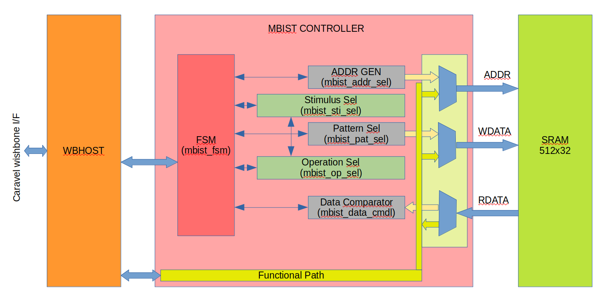

```
  MBIST Controller


Permission to use, copy, modify, and/or distribute this soc for any
purpose with or without fee is hereby granted, provided that the above
copyright notice and this permission notice appear in all copies.

THE SOC IS PROVIDED "AS IS" AND THE AUTHOR DISCLAIMS ALL WARRANTIES
WITH REGARD TO THIS SOC INCLUDING ALL IMPLIED WARRANTIES OF
MERCHANTABILITY AND FITNESS. IN NO EVENT SHALL THE AUTHOR BE LIABLE FOR
ANY SPECIAL, DIRECT, INDIRECT, OR CONSEQUENTIAL DAMAGES OR ANY DAMAGES
WHATSOEVER RESULTING FROM LOSS OF USE, DATA OR PROFITS, WHETHER IN AN
ACTION OF CONTRACT, NEGLIGENCE OR OTHER TORTIOUS ACTION, ARISING OUT OF
OR IN CONNECTION WITH THE USE OR PERFORMANCE OF THIS SOC.
```

# Table of contents
- [Overview](#overview)
- [MBIST Controller Block Diagram](#mbist-controller-block-diagram)
- [Key Feature](#key-features)
- [Prerequisites](#prerequisites)
- [Tests preparation](#tests-preparation)
    - [Running Simuation](#running-simulation)
- [Tool sets](#tool-sets)
- [Documentation](#documentation)


# Overview

MBIST is a self-testing and repair mechanism which tests the memories through an effective set of algorithms to detect possibly all the faults that could be present inside a typical memory cell whether it is stuck-at (SAF), transition delay faults (TDF), coupling (CF) or neighborhood pattern sensitive faults (NPSF).  This project uses only open source tool set for simulation,synthesis and backend tools.  The SOC flow follow the openlane methodology and SOC environment is compatible with efabless/carvel methodology.

# MBIST Block Diagram

<table>
  <tr>
    <td  align="center"></td>
  </tr>

</table>


# Key features
```
    * Open sourced under Apache-2.0 License (see LICENSE file) - unrestricted commercial use allowed.
    * Mbist controller with memory repair supported
    * Currently only Row Redudency is supported
    * 4 Address location memory repair reported
    * 2KB SRAM
    * Wishbone compatible design
    * Written in System Verilog
    * Open-source tool set
       * simulation - iverilog
       * synthesis  - yosys
       * backend/sta - openlane tool set
    * Verification suite provided.
```


# Prerequisites
   - Docker (ensure docker daemon is running) -- tested with version 19.03.12, but any recent version should suffice.
## Step-1: Docker in ubuntu 20.04 version
```bash
   sudo apt update
   sudo apt-get install apt-transport-https curl rtificates -agent software-properties-common
   curl -fsSL https://download.docker.com/linux/ubuntu/gpg | sudo apt-key add -
   sudo add-apt-repository "deb [arch=amd64] https://download.docker.com/linux/ubuntu focal stable"
   sudo apt update
   apt-cache policy docker-ce
   sudo apt install docker-ce

   #Add User Name to docker
   sudo usermod -aG docker <your user name>
   # Reboot the system to enable the docker setup
```
##  Step-2: Update the Submodule, To to project area
```bash
   git submodule init
   git submodule update
```
## Step-3: clone Openlane scripts under workarea
```bash
   git clone https://github.com/The-OpenROAD-Project/OpenLane.git
```

## Step-4: add Environment setting
```bash
    export CARAVEL_ROOT=<Carvel Installed Path>
    export OPENLANE_ROOT=<OpenLane Installed Path>
    export OPENLANE_IMAGE_NAME=efabless/openlane:latest
    export PDK_ROOT=<PDK Installed PATH>
    export PDK_PATH=<PDK Install Path>/sky130A
```
## Step-5: To install the PDK
```bash
   source ~/.bashrc
   cd OpenLane
   make pdk
```

# Tests preparation

The simulation package includes the following tests:

* **wb_port**        - User Wishbone validation
* **user_mbist_test1** - Standalone Mbist Controller Specific Test for Non Error/Single/Two/Three/Four/Five Location Error


# Running Simulation

Examples:
``` sh
    make verify-wb_port  
    make verify-user_mbist_test1
    make verify-wb_port SIM=RTL DUMP=OFF
    make verify-wb_port SIM=RTL DUMP=ON
    make verify-user_mbist_test1 SIM=RTL DUMP=OFF
    make verify-user_mbist_test1 SIM=RTL DUMP=ON
```

# Tool Sets

Mbist Controller flow uses Openlane tool sets.

1. **Synthesis**
    1. `yosys` - Performs RTL synthesis
    2. `abc` - Performs technology mapping
    3. `OpenSTA` - Pefroms static timing analysis on the resulting netlist to generate timing reports
2. **Floorplan and PDN**
    1. `init_fp` - Defines the core area for the macro as well as the rows (used for placement) and the tracks (used for routing)
    2. `ioplacer` - Places the macro input and output ports
    3. `pdn` - Generates the power distribution network
    4. `tapcell` - Inserts welltap and decap cells in the floorplan
3. **Placement**
    1. `RePLace` - Performs global placement
    2. `Resizer` - Performs optional optimizations on the design
    3. `OpenPhySyn` - Performs timing optimizations on the design
    4. `OpenDP` - Perfroms detailed placement to legalize the globally placed components
4. **CTS**
    1. `TritonCTS` - Synthesizes the clock distribution network (the clock tree)
5. **Routing**
    1. `FastRoute` - Performs global routing to generate a guide file for the detailed router
    2. `CU-GR` - Another option for performing global routing.
    3. `TritonRoute` - Performs detailed routing
    4. `SPEF-Extractor` - Performs SPEF extraction
6. **GDSII Generation**
    1. `Magic` - Streams out the final GDSII layout file from the routed def
    2. `Klayout` - Streams out the final GDSII layout file from the routed def as a back-up
7. **Checks**
    1. `Magic` - Performs DRC Checks & Antenna Checks
    2. `Klayout` - Performs DRC Checks
    3. `Netgen` - Performs LVS Checks
    4. `CVC` - Performs Circuit Validity Checks


## Contacts

Report an issue: <https://github.com/dineshannayya/mbist_ctrl/issues>

# Documentation


